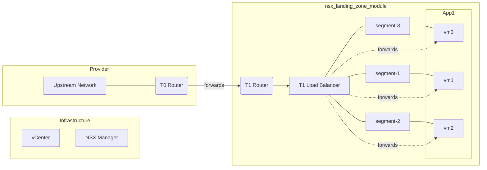

# Terraform vSphere NSX

This is an example deployment of a basic 'vSphere' landing zone on NSX. It includes basic services and network topologies accessible in the default routing domain.

### Topology

### To Think About

* Folder creation
* Tag creation
* Allocation RP
* Role Creation and Delegation
* Default Rules / NSX tags
* Module refactor / first principals
* 

